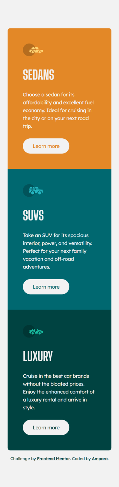

# Frontend Mentor - 3-column preview card component solution

This is my solution to the [3-column preview card component challenge on Frontend Mentor](https://www.frontendmentor.io/challenges/3column-preview-card-component-pH92eAR2-).

## Table of contents

- [Overview](#overview)
  - [The challenge](#the-challenge)
  - [Screenshots](#screenshots)
  - [Links](#links)
- [My process](#my-process)
  - [Built with](#built-with)
  - [Useful resources](#useful-resources)
- [Author](#author)

## Overview

### The challenge

Users should be able to:

- View the optimal layout depending on their device's screen size
- See hover states for interactive elements

### Screenshots

#### Desktop

##### Hover state

#### Tablet

#### Mobile

### Links

- [Solution on Frontend Mentor](https://www.frontendmentor.io/solutions/responsive-3column-preview-card-component-using-tailwind-css-6XVXQsLv56)
- [Live version](https://amparoamparo.github.io/frontendmentor-3-column-preview-card/)

## My process

Since this design was pretty straight-forward, I saw it as an opportunity to time myself and gain a realistic understanding of how long a similar task would take me.

Including writing the README, the entire process took me approximately **4 hours**. I could've completed it in less time, but I chose to use Tailwind CSS, which I hadn't used in over 2 months, so I needed some time to refresh my memory on certain classes.

Although it wasn't a requirement, I also implemented styling for tablet-sized views, ensuring that the project is highly responsive and visually consistent across all screen sizes.

### Built with

- Semantic HTML
- Tailwind CSS
- CSS Grid
- Mobile-first workflow
- Figma

Note: I don't have a PRO account, so I did not have the Figma files. Working with the provided screenshots of the original designs, I used Figma to measure elements and spacing.

### Observations

There were a few points from the style guide that I intentionally didn't follow:

1. The style guide specified a body font size of 15px, but after testing, I found that using 1rem (without changing the default font size of 16px) worked perfectly, so I decided not to change the default size.

2. I noticed several colour contrast issues in the provided design. Instead of using the "transparent white" colour as indicated in the style guide, I used the "light grey" colour for all text, to improve readability by providing additional contrast. However, it's important to note that the orange section still **does not meet the required WCAG colour contrast ratios**. In a real-life scenario, the component would need to be redesigned completely to ensure compliance.

### Useful resources

- [Tailwind CSS documentation](https://tailwindcss.com/docs) - Obviously a must, as I hadn't used Tailwind CSS in a while!

## Author

- Website - [amparo.codes](https://amparo.codes)
- Frontend Mentor - [@amparoamparo](https://www.frontendmentor.io/profile/amparoamparo)
